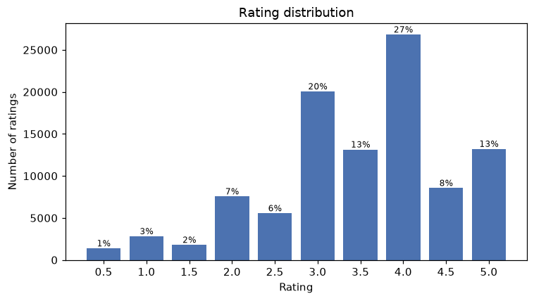
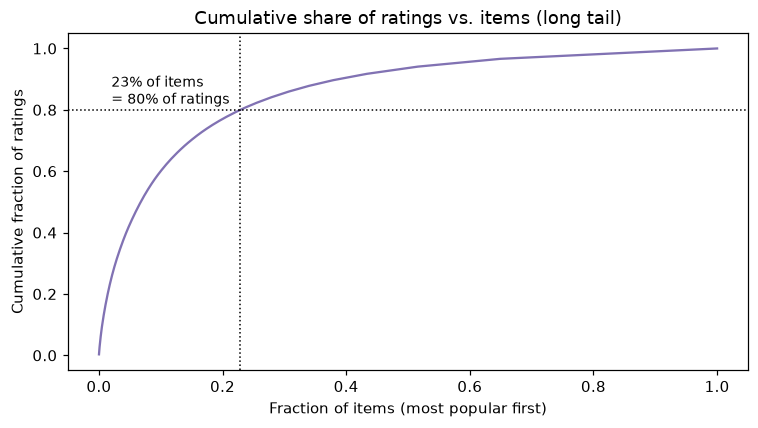
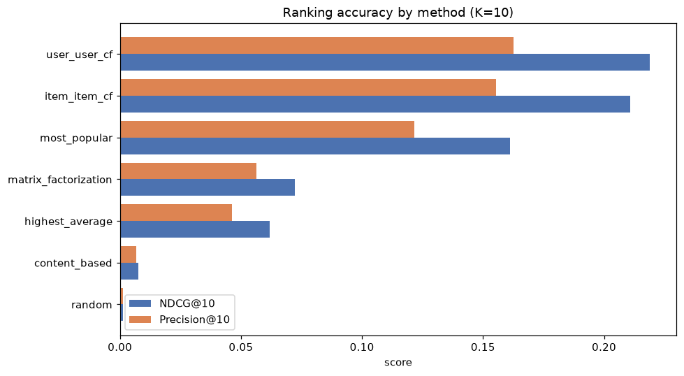
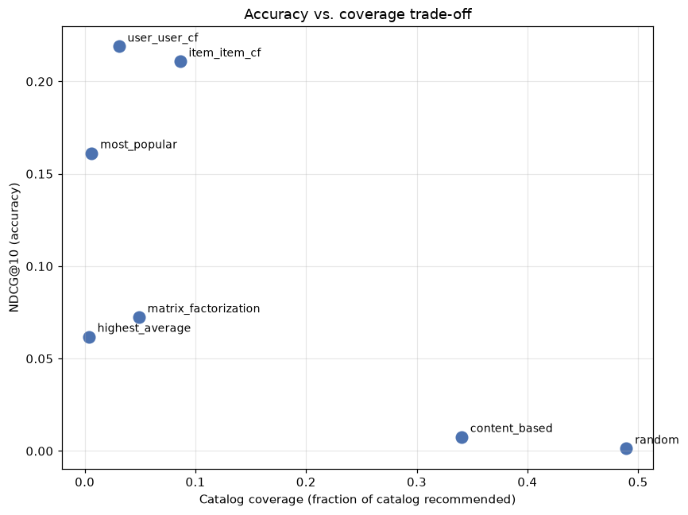
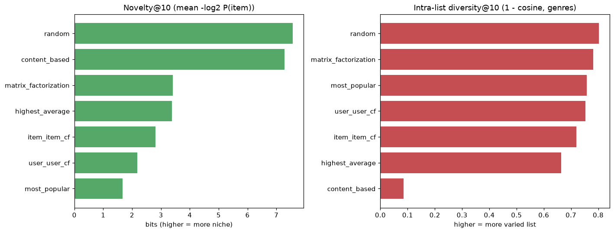
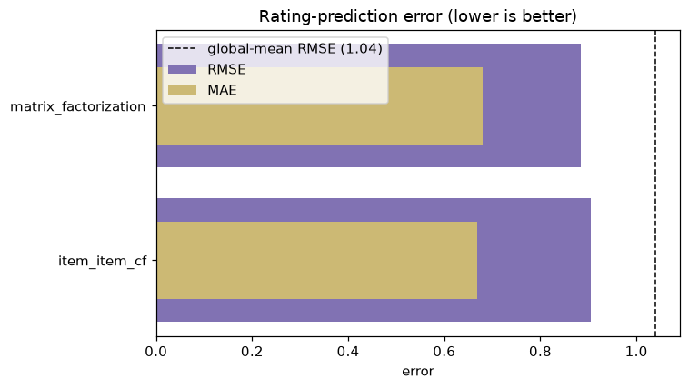

# Movie Recommender Systems — Individual Project Report

**Author:** Hiroaki Nakano
**Course:** Recommender Systems — Prof. Marc Torrens, Esade
**Date:** June 2026
**Track:** Movies — MovieLens Latest Small

---

## 1. Introduction

The goal of this project is to build a single movie-recommendation prototype and
grow it method by method, so that the same data and the same evaluation protocol
can be used to compare a family of algorithms fairly. Rather than chasing a single
"best" model, the project treats recommendation as a multi-objective problem:
accuracy matters, but so do catalog coverage, novelty, diversity and popularity
bias. The deliverable is therefore both a set of working, comparable algorithms
and a critical analysis of *when* and *why* each one is appropriate.

Concretely, the prototype implements seven recommenders — three non-personalized
baselines, a content-based model, item-item and user-user collaborative filtering,
and a matrix-factorization model — evaluates them with a common top-N protocol plus
beyond-accuracy and rating-prediction metrics, and exposes everything through an
interactive Streamlit application.

All code is organized as a small Python package (`src/`), orchestrated by
`main.py`, with two analysis notebooks (`notebooks/01_eda.ipynb`,
`notebooks/02_comparison.ipynb`) and the demo app (`app.py`).

## 2. Dataset description

I use the **MovieLens Latest Small** dataset from GroupLens
(https://grouplens.org/datasets/movielens/), which is free for research and
educational use (see `data/raw/ml-latest-small/README.txt`). It consists of two
core files:

- `ratings.csv` — `userId, movieId, rating, timestamp`
- `movies.csv` — `movieId, title, genres` (pipe-separated genres)

Headline statistics:

| Property | Value |
|---|---|
| Users | 610 |
| Movies (rated) | 9,724 |
| Movies (catalog) | 9,742 |
| Ratings | 100,836 |
| Rating scale | 0.5 – 5.0 (mean 3.5, mode 4.0) |
| Density | 1.7% (sparsity 98.3%) |
| Ratings per user | min 20, median 70, max 2,698 |
| Ratings per item | min 1, median 3, max 329 |

Two facts drive every design decision that follows. First, the user-item matrix is
**98.3% sparse** — which, although it sounds extreme, is normal (even relatively
dense) by recommender-system standards. Second, the sparsity is **asymmetric**:
users are comparatively well-described (median 70 ratings each) while items are
thin (median 3 ratings each, with a heavy long tail). The weak axis is the item
axis, and that is exactly where collaborative methods struggle.

## 3. Preprocessing and EDA

Loading and validation live in `src/data_loading.py` (`load_ratings`,
`load_items` check that the expected columns are present). The EDA is in
`notebooks/01_eda.ipynb`; the key figures are reproduced below.

**Rating distribution.** Ratings skew positive (mean 3.5, mode 4.0). This
*positivity bias* is why I define relevance as a rating ≥ 4.0 in the evaluation:
simply being rated is not the same as being liked.



**Activity distributions and the long tail.** A few power users and a small head
of blockbuster movies dominate. About **20% of the most popular movies account for
80% of all ratings** — the classic long tail, and the reason a most-popular
baseline is hard to beat on raw accuracy.



**Train/test split.** `train_test_split_ratings` performs a **per-user stratified
80/20 split** so that every user keeps part of their history for training and part
as held-out test items. This is required for top-N evaluation: we must be able to
build a profile for each user from `train` and check held-out positives from
`test`. All 610 users appear in both splits (80,668 train / 20,168 test ratings).

## 4. Algorithms implemented

All recommenders share the same interface: `fit(...)` and
`recommend(user_id, ratings_train, n, exclude_seen)` returning `(item_id, score)`
pairs. This uniformity is what makes a fair comparison possible.

**Non-personalized baselines** (`src/baselines.py`):
- *Most Popular* — rank items by number of ratings.
- *Highest Average* — rank by mean rating, requiring ≥ 20 ratings so a single
  5-star rating cannot top the chart.
- *Random* — unseen items at random; a lower bound and a high-coverage reference.

**Content-based** (`src/content_based.py`): each movie is a **TF-IDF vector over
its genres**; a user profile is the mean-centered, rating-weighted sum of the
vectors of the movies they rated, and recommendations are the unseen items most
cosine-similar to that profile. Because it depends only on metadata, it is immune
to user-item sparsity and can score even long-tail items.

**Collaborative filtering** (`src/collaborative_filtering.py`): item-item and
user-user k-NN using **adjusted cosine** similarity (ratings mean-centered per
user). Two sparsity safeguards are essential here:
- *min_support* — items rated by fewer than 5 users are excluded from the
  neighbourhood model (their co-rating signal is too thin to trust).
- *shrinkage* — `sim_adj(i,j) = n_ij / (n_ij + λ) · sim(i,j)`, where `n_ij` is the
  number of users who rated both items, so a 2-user overlap cannot yield a
  spurious similarity of 1.0.

An important implementation detail: for top-N **ranking** the models rank by the
*unnormalized* weighted sum `Σ sim(i,j)·centered_r(u,j)`. Normalizing by `Σ|sim|`
is correct for *rating prediction* but, for ranking, it lets a single weak
neighbour produce an extreme score and floods the list with low-support tail
items. `predict_score` keeps the normalized form for RMSE/MAE.

**Matrix factorization** (`src/matrix_factorization.py`): a biased model
`r̂(u,i) = μ + b_u + b_i + p_u · q_i` trained with **stochastic gradient descent**
on the observed ratings, minimizing regularized squared error. It is implemented
from scratch in NumPy rather than via scikit-surprise (which does not build on the
Python 3.14 / NumPy 2.x environment used here), which also keeps the model fully
transparent. This is the canonical answer to sparsity: it learns dense latent
vectors from observed ratings instead of relying on direct co-ratings.

## 5. Evaluation protocol

Implemented in `src/evaluation.py` and run by `main.py`.

- **Relevance:** a held-out test item is relevant for a user if rated ≥ 4.0.
- **Top-N ranking (K = 10):** Precision@K, Recall@K, NDCG@K, MRR@K, Hit-Rate@K.
- **Beyond-accuracy:** catalog coverage (fraction of catalog ever recommended),
  novelty (mean self-information `−log₂ P(item)`), and intra-list diversity
  (mean pairwise `1 − cosine` over genre vectors).
- **Rating prediction** (models exposing `predict_score`): RMSE and MAE.

Recommendations are generated from training data only, excluding items already
seen in training. Metrics are averaged over the 599 users who have at least one
relevant test item.

## 6. Results

### 6.1 Ranking and beyond-accuracy (K = 10)

| Method | NDCG | P@10 | Recall | MRR | HitRate | Coverage | Novelty | Diversity |
|---|---|---|---|---|---|---|---|---|
| **User-User CF** | **0.219** | **0.163** | 0.145 | 0.393 | 0.648 | 0.031 | 2.19 | 0.75 |
| Item-Item CF | 0.211 | 0.155 | 0.126 | 0.402 | 0.644 | 0.086 | 2.80 | 0.72 |
| Most Popular | 0.161 | 0.122 | 0.104 | 0.312 | 0.574 | 0.006 | 1.66 | 0.76 |
| Matrix Factorization | 0.072 | 0.056 | 0.041 | 0.168 | 0.356 | 0.049 | 3.41 | 0.78 |
| Highest Average | 0.062 | 0.046 | 0.034 | 0.151 | 0.301 | 0.004 | 3.39 | 0.66 |
| Content-Based | 0.008 | 0.007 | 0.005 | 0.019 | 0.063 | 0.341 | 7.28 | 0.085 |
| Random | 0.001 | 0.001 | 0.001 | 0.004 | 0.013 | 0.489 | 7.57 | 0.80 |

*(Source: `results/metrics.csv`.)*



### 6.2 The accuracy vs. coverage trade-off



The single most important result is not any one number but the **frontier**: the
most accurate methods (CF) recommend from a tiny slice of the catalog, while
high-coverage methods (content-based, random) are inaccurate. There is no method
that is simultaneously accurate and high-coverage; a real product must *choose* a
point on this frontier.

### 6.3 Novelty and diversity



Novelty rises as methods move away from the popular head. The striking case is the
content-based model: **highest novelty but lowest intra-list diversity (0.085)** —
it keeps recommending items from the user's single favourite genre cluster, which
is varied across the catalog (novel) but monotonous within one list (undiverse).

### 6.4 Rating prediction

| Method | RMSE | MAE |
|---|---|---|
| **Matrix Factorization** | **0.885** | 0.679 |
| Item-Item CF | 0.905 | 0.669 |

*(Source: `results/rating_metrics.csv`; global-mean baseline RMSE = 1.039,
item-mean baseline RMSE = 0.976.)*



Matrix factorization is the **weakest top-N model but the best rating predictor**,
improving on the global-mean baseline by ~15%. This is the key nuance of the whole
project: MF minimizes squared error, which is *not* a ranking objective, so a low
RMSE does not translate into a good top-10. "MF doesn't work" would be the wrong
conclusion — it optimizes a different objective.

### 6.5 Ablation: TF-IDF vs. raw genre vectors

The content-based model vectorizes each movie over its **genres** (one movie = one
"document", each genre = one token). I compared the TF-IDF weighting against plain
**raw genre vectors** (L2-normalized 0/1 presence, every genre equal). Since each
genre appears at most once per movie the term-frequency is always 1, so the only
thing TF-IDF changes is the **IDF** term — down-weighting ubiquitous genres
(Drama, Comedy) and up-weighting rare, distinctive ones (Film-Noir, Western, IMAX).

| Variant | NDCG | P@10 | Recall | HitRate | Coverage | Novelty | Diversity |
|---|---|---|---|---|---|---|---|
| **TF-IDF genres** | **0.0076** | **0.0068** | **0.0047** | **0.063** | 0.341 | 7.28 | **0.085** |
| Raw genre vectors | 0.0056 | 0.0058 | 0.0035 | 0.053 | **0.352** | **7.29** | 0.075 |

*(Same metric set as the main results table. Bold = better per column. Source:
`results/ablation_tfidf.csv`; diversity measured in a fixed shared genre space.)*

TF-IDF wins 5 of the 7 metrics — all four accuracy metrics (NDCG +36% relative,
0.0056 → 0.0076; hit-rate 0.053 → 0.063) plus intra-list diversity. By emphasizing
distinctive genres it builds more discriminative user profiles. Raw genre vectors
only edge ahead on coverage and novelty, because weighting every genre equally
spreads recommendations slightly wider across the catalog. The overall gain is
modest because the genre vocabulary is tiny (~20 tokens) and TF is always 1, so
only the IDF term is active; a richer text signal (tags, synopsis) would give
TF-IDF far more to work with.

## 7. Recommendation examples

Top-5 recommendations for three users with different profiles (from `main.py`):

**User 1** — 186 ratings, avg 4.41 (an enthusiast):
- *Most Popular:* Pulp Fiction · Shawshank Redemption · Braveheart · Terminator 2
- *Item-Item CF:* Pulp Fiction · Snatch · Memento · The Godfather · Back to the Future
- *User-User CF:* Pulp Fiction · Shawshank Redemption · The Godfather · Godfather II · Donnie Darko
- *Content-Based:* Anastasia · Tarzan · Up · Dumbo · Free Willy *(animation cluster)*
- *Matrix Factorization:* Shawshank Redemption · Sound of Music · Godfather II · Spirited Away

**User 599** — 1,982 ratings, avg 2.64 (a critical heavy user):
- *Most Popular:* The Matrix · Star Wars IV · Schindler's List · Empire Strikes Back
- *Item-Item CF:* Eternal Sunshine · The Matrix · Kill Bill 2 · Star Wars IV
- *User-User CF:* Star Wars IV · The Matrix · Empire Strikes Back · LotR: Fellowship
- *Content-Based:* Home for the Holidays · Mr. Holland's Opus · Tape · Focus
- *Matrix Factorization:* Lawrence of Arabia · Donnie Darko · Kill Bill 2 · Some Like It Hot

The qualitative differences match the metrics: CF leans on well-loved classics
that overlap with what similar users enjoyed; content-based produces tight,
same-genre lists (high novelty, low diversity); MF mixes critically acclaimed
films from the learned latent space. These can be explored interactively, with
per-recommendation explanations, in the Streamlit app (`streamlit run app.py`).

## 8. Discussion of limitations

- **Single random split.** Results come from one 80/20 split; cross-validation or
  a temporal (leave-last-out by timestamp) split would give more robust estimates
  and better reflect real deployment.
- **Fixed relevance threshold.** Relevance is binary at ≥ 4.0; results shift with
  the threshold and ignore graded relevance.
- **Popularity dominates offline top-N.** Because popular items appear often in the
  test set, offline accuracy rewards popularity; online A/B testing would judge
  discovery value differently.
- **MF uses an RMSE objective.** It is structurally handicapped on ranking; a
  pairwise/implicit objective (BPR, ALS, logistic MF) would be a fairer latent-factor
  competitor on top-N.
- **Content signal is genres only.** Diversity is measured over genres only;
  richer features (tags, cast, synopsis embeddings) would sharpen the content-based
  model and the diversity metric.
- **Cold start not isolated.** New users/items are not analysed separately, even
  though that is where content-based and MF biases would shine.

## 9. Conclusion

Building one prototype and comparing seven methods on identical data made the
trade-offs concrete. Neighbourhood collaborative filtering — user-user slightly
ahead of item-item, thanks to the denser user axis — gives the best top-N ranking
on MovieLens. Most-popular is a deceptively strong accuracy baseline but reaches
only 0.6% of the catalog, a textbook case of popularity bias. Matrix factorization
is the best rating predictor yet a weak ranker, a clean illustration that the
optimization objective must match the task. And the accuracy–coverage–novelty
trade-offs show that "best" is product-dependent, not absolute.

The most valuable engineering lessons were about sparsity: standard methods *do*
work at 98% sparsity, provided each method is matched to the data's weak axis (MF
and content-based for the thin item tail) and neighbourhood CF is protected with
shrinkage, minimum support, and — crucially — ranked by the right score. Natural
next steps are a hybrid CF + content model to cover cold/long-tail items and a
ranking-objective matrix factorization to make latent factors competitive on
top-N.

A final, broader caveat concerns evaluation itself. Moving "beyond accuracy" to
coverage, novelty and diversity — and, in production, to long-term retention or
satisfaction — does not escape bias; it relocates it. **There is no unbiased
objective: every metric encodes both a value judgement (whose interest is being
optimised) and a measurement process, each with its own bias.** Offline accuracy
inherits the exposure / feedback bias of the policy that generated the data;
retention suffers survivorship bias (churned users leave no trace) and can reward
compulsive rather than genuinely satisfying engagement; and by Goodhart's law any
single target, once optimised hard, decouples from the true — and unobservable —
goal of long-term user utility. The practical response is not to hunt for the one
"correct" metric but to make the biases explicit and manage them: optimise a basket
of metrics with guardrails, inject exploration and use counterfactual estimators to
debias feedback loops, analyse results per user segment, and keep long-term
holdouts and human judgement in the loop. This is the deeper reading of "accuracy
is not enough" — its replacements are not neutral either.

---

### Appendix — How to reproduce

```bash
pip install -r requirements.txt
python main.py                 # runs the full pipeline, writes results/metrics.csv
python build_artifacts.py      # caches trained models for the app
streamlit run app.py           # interactive prototype
python build_slides.py         # rebuilds the slide deck
```

Notebooks: `notebooks/01_eda.ipynb` (EDA), `notebooks/02_comparison.ipynb`
(results & figures).
